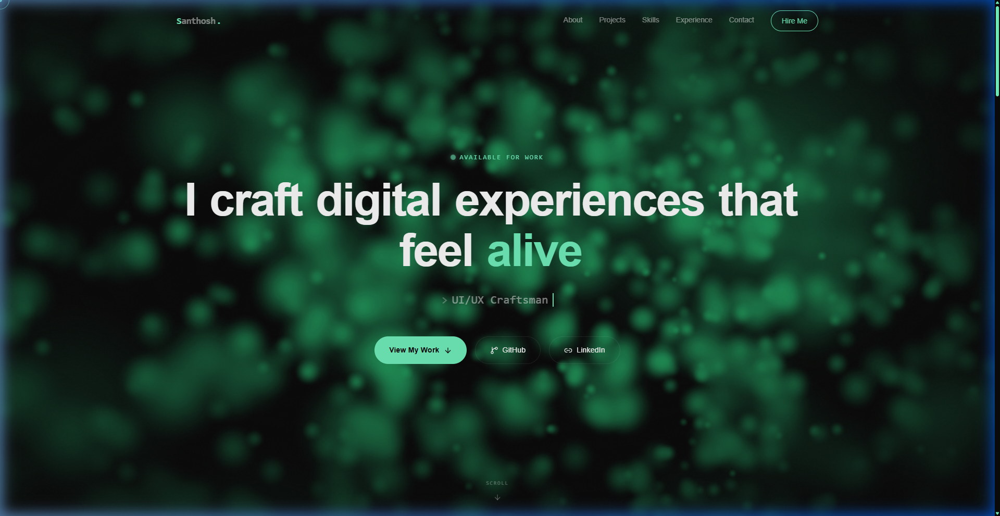
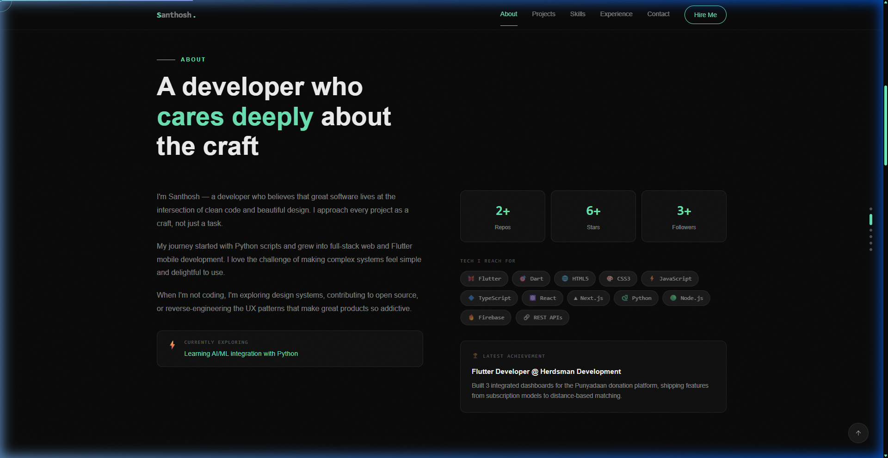
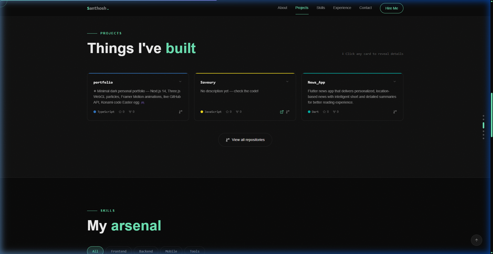
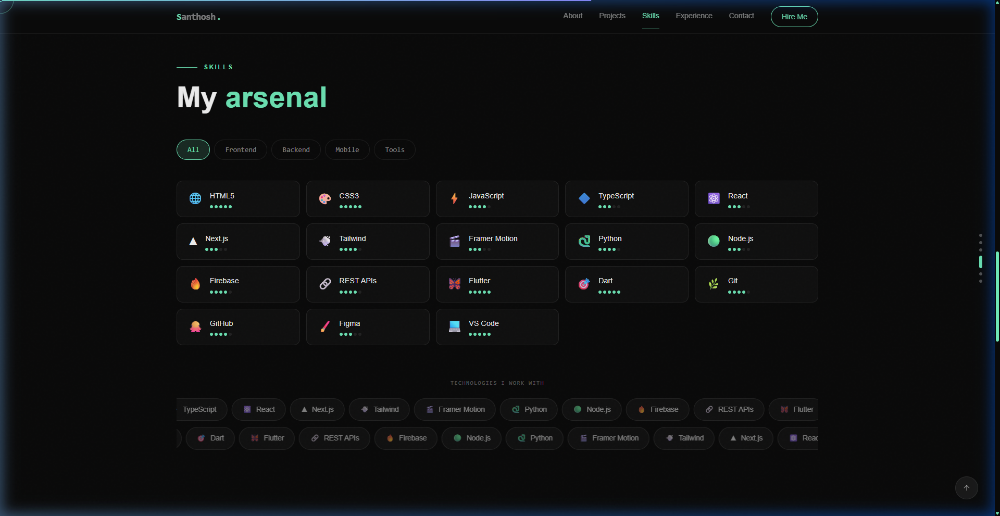
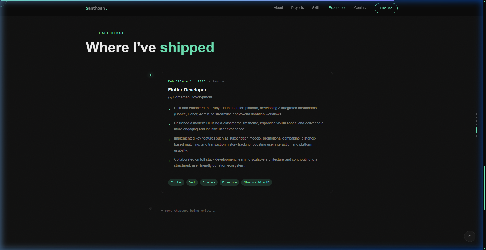
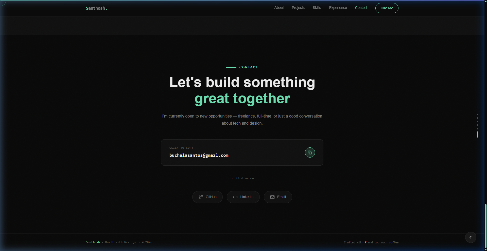

<div align="center">

# ✦ Santhosh — Personal Portfolio

**A pixel-perfect, minimal dark portfolio built with Next.js 14, Three.js, Framer Motion & Tailwind CSS**

[](https://nextjs.org/)
[](https://www.typescriptlang.org/)
[](https://tailwindcss.com/)
[](https://www.framer.com/motion/)
[](https://threejs.org/)

[**LinkedIn**](https://www.linkedin.com/in/buchala-santhosh/) &nbsp;·&nbsp; [**GitHub**](https://github.com/Santhosh7474)

</div>

---

## 📸 Preview

<table>
  <tr>
    <td align="center"><b>Hero — Three.js Particle Cloud</b></td>
    <td align="center"><b>About — Live GitHub Stats</b></td>
  </tr>
  <tr>
    <td></td>
    <td></td>
  </tr>
  <tr>
    <td align="center"><b>Projects — Live GitHub API</b></td>
    <td align="center"><b>Skills — Tabs + Infinite Marquee</b></td>
  </tr>
  <tr>
    <td></td>
    <td></td>
  </tr>
  <tr>
    <td align="center"><b>Experience — Animated Timeline</b></td>
    <td align="center"><b>Contact + Footer</b></td>
  </tr>
  <tr>
    <td></td>
    <td></td>
  </tr>
</table>

---

## ✨ Features

### 🎨 Design System
- **Dark minimal theme** — `#0a0a0a` base, `#6EE7B7` mint accent, barely-there borders
- **Geist Sans + Geist Mono** — Vercel's variable fonts
- **Custom cursor** — spring-following ring that expands on hoverable elements
- **Noise texture overlay** — subtle depth throughout

### 🌟 Sections

| Section | Highlights |
|---|---|
| **Loading Screen** | Staggered character reveal · animated 0→100% counter · two-phase easing (~4–5 s) |
| **Navigation** | Frosted-glass · animated underline follows active section · full-screen mobile overlay |
| **Hero** | Three.js 2500-particle WebGL shader (mouse-reactive) · word-blur headline · typewriter role cycle |
| **About** | Live GitHub stat counters · currently-exploring ticker · staggered skill pills |
| **Projects** | GitHub REST API · skeleton loaders · expandable cards · 3D tilt · language color borders |
| **Skills** | Tab filter with crossfade · proficiency dots · dual-direction infinite marquee |
| **Experience** | Animated drawing timeline line · glowing dots · tech tag pills |
| **Contact** | Click-to-copy email + toast · social links with color hover |

### ⚡ Interactive Extras
- **Reading progress bar** — thin gradient line at top of viewport
- **Section indicator** — right-side dots, active one stretches to a pill
- **Konami code Easter egg** — `↑↑↓↓←→←→BA` toggles accent colour
- **3D card tilt** — mouse-tracked perspective on project cards (max 8°)

---

## 🛠 Tech Stack

| Layer | Tech |
|---|---|
| Framework | Next.js 16 (App Router) + TypeScript |
| Styling | Tailwind CSS + CSS custom properties |
| Animation | Framer Motion |
| 3D / WebGL | Three.js (hero particle shader, dynamic import, SSR off) |
| Icons | Lucide React |
| Fonts | Geist Sans + Geist Mono (`next/font`) |
| Data | GitHub REST API with sessionStorage cache (5 min TTL) |

---

## 🚀 Running Locally

```bash
# Clone
git clone https://github.com/Santhosh7474/portfolio.git
cd portfolio

# Install
npm install

# Dev server
npm run dev
```

Open [http://localhost:3000](http://localhost:3000)

---

## 📁 Project Structure

```
src/
├── app/
│   ├── globals.css          # Design system — tokens, cursor, glass cards, marquee…
│   ├── layout.tsx           # Fonts + SEO metadata
│   └── page.tsx             # Page assembly
├── components/
│   ├── LoadingScreen.tsx    # Animated preloader (every page load)
│   ├── CustomCursor.tsx     # Spring-following cursor ring
│   ├── ReadingProgress.tsx  # Top scroll progress bar
│   ├── SectionIndicator.tsx # Right-side section dots
│   ├── KonamiEasterEgg.tsx  # Secret colour mode
│   ├── Navbar.tsx           # Frosted-glass navbar
│   ├── Hero.tsx             # Full-height hero
│   ├── HeroCanvas.tsx       # Three.js WebGL particles
│   ├── About.tsx            # Stats + skills + ticker
│   ├── Projects.tsx         # GitHub API cards
│   ├── Skills.tsx           # Tabs + marquee
│   ├── Experience.tsx       # Timeline
│   ├── Contact.tsx          # Email + socials
│   └── Footer.tsx           # Footer
├── lib/
│   ├── constants.ts         # Site config, skills, experience data
│   └── github.ts            # GitHub API with cache
└── types/
    └── index.ts             # TypeScript interfaces
```

---

## 🎮 Easter Egg

Type the **Konami code** anywhere on the page:

```
↑  ↑  ↓  ↓  ←  →  ←  →  B  A
```

The accent switches from mint → pink. Type again to toggle back.

---

<div align="center">
  <p>Crafted with ♥ and too much coffee &nbsp;·&nbsp; <a href="https://www.linkedin.com/in/buchala-santhosh/">Santhosh</a></p>
</div>
